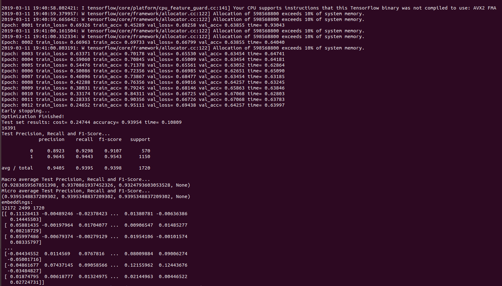

# Graph Convolutional Networks - Application

This is a TensorFlow implementation of Graph Convolutional Networks for SemEval 2019 Task 6: OffensEval: Identifying and Categorizing Offensive Language in Social Media and in specific Sub-task A - Offensive language identification.

## Requirements

* tensorflow (>0.12)
* networkx

## Run

* Use (Clean_Tweets.ipynb)[data/Clean_Tweets.ipynb] to clean your .csv or .tsv files and generate corresponding .txt files. Place the generated files appropritely in corpus or R8 sub-folder under the data folder.

* Use (pre-processing.ipynb)[pre-processing.ipynb] to pre-processing the data and generate required files.

* Use (build_graph.ipynb)[build_graph.ipynb] to generate the graph.

* Finally run:
```
python3 train.py R8
```

## Data

I have used a part of the OLID dataset (2499 tweets) ([accepted in NAACL in 2019](https://naacl2019.org/program/accepted/)) for this experiment. I have converted the tsv file to Graph using (build_graph.ipynb)[build_graph.ipynb]

## Papers blogs referred

I have used information from the following papers:
* `gcn`: Graph convolutional network (Thomas N. Kipf, Max Welling, [Semi-Supervised Classification with Graph Convolutional Networks](http://arxiv.org/abs/1609.02907), 2016) (ICLR 2017)
* `gcn_cheby`: Chebyshev polynomial version of graph convolutional network as described in (Michaël Defferrard, Xavier Bresson, Pierre Vandergheynst, [Convolutional Neural Networks on Graphs with Fast Localized Spectral Filtering](https://arxiv.org/abs/1606.09375), NIPS 2016)
* Thomas Kipf, [Graph Convolutional Networks](http://tkipf.github.io/graph-convolutional-networks/) (2016)

## Graph classification

Our framework also supports batch-wise classification of multiple graph instances (of potentially different size) with an adjacency matrix each. It is best to concatenate respective feature matrices and build a (sparse) block-diagonal matrix where each block corresponds to the adjacency matrix of one graph instance. For pooling (in case of graph-level outputs as opposed to node-level outputs) it is best to specify a simple pooling matrix that collects features from their respective graph instances, as illustrated below:


## Output

Here is an instance of output:



I had forcibly labelled all the test set instances as NOT offensive and the model was allowed to predict. Accordingly the confusion matrix was generated.

## Note

This is my first GCN Experiment. :tada:
Any constructive criticism is highly appreciated.